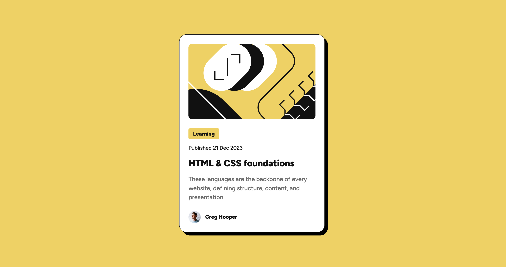

Built a blog preview card from the Frontend Mentor assignment. 

Got a refresher when it comes to viewport-borders, and also the calc() function so that we get responsive scaling of the card. 

Need to work a bit more on understanding the hierarchy of priorities when it comes to flexbox, and how the different elements affect eachother. I always figure it out, but I'd like to know it by heart. 

